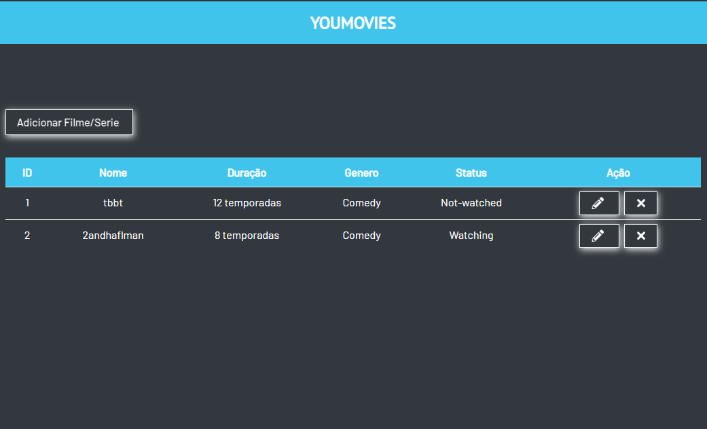
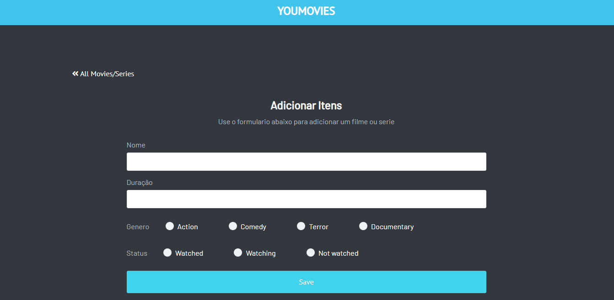
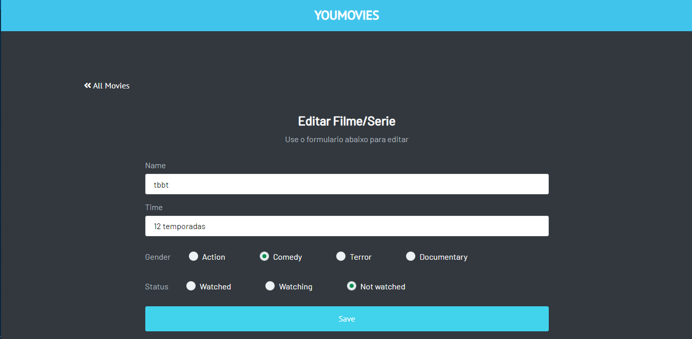

# YouMovie
Neste projeto criaremos um CRUD com Node/express e mongodb.

#### Para Rodar esse projeto:
```
npm install
```

Depois crie um arquivo chamado config.env e dentro do arquivo configure com  "PORT" = "NumeroDaPortaDesejada e MONGO_URI = "Caminho do seu Cluster MongoDB.
Agora voce ja pode rodar 
```
npm start
```

Abraço..!

#### Tela Listar/Deletar - Filmes/Series

#### Tela Adicionar

#### Tela Editar Filme/Serie

